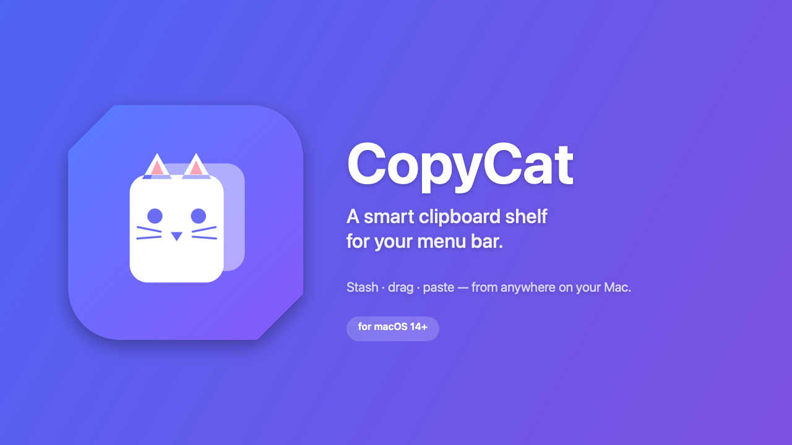

<p align="center">
  
</p>

<h1 align="center">CopyCat 🐈</h1>

<p align="center">
  A minimal, open-source <b>menu bar shelf</b> for macOS — a temporary dock for everything you copy.
</p>

<p align="center">
  
  
  
</p>

---

Pull CopyCat down from the menu bar and park anything on it — text, images, links,
or files — then drag it back out into any app, or paste it with a single keystroke.
It makes copy/paste and drag-and-drop across screens effortless.

## Features

- **Lives in the menu bar** — no Dock icon, no window clutter.
- **Global hotkey** — toggle the panel from anywhere with **⌥⌘V**.
- **Auto clipboard capture** — turn it on and everything you ⌘C lands on the shelf
  automatically. Password managers / concealed items are always excluded.
- **Quick-paste by number** — open the shelf and press **1–9** to paste that item
  straight into the app you came from.
- **Smart content types** — colors show a live swatch, code renders monospaced,
  links get an "open" button, and images get one-tap **OCR** to extract their text.
- **Drag in, drag out** — drop onto the panel (or straight onto the menu bar icon),
  and drag any item back out into any app or Finder.
- **Numbered & ordered** — items are numbered in copy order; "copy all in order"
  grabs the whole list at once.
- **Floats & stays put** — the panel stays open while you work; move it by its header.
- **Persistent** — items (and their files) survive restarts.
- **Auto-updates** via Sparkle. Clean, translucent, native SwiftUI.

## Install

**Download:** grab the latest signed & notarized `CopyCat.dmg` from
[Releases](../../releases), open it, and drag CopyCat into Applications.

**Or build from source:**

```bash
git clone https://github.com/upbrew/copycat.git
cd copycat
./build_app.sh          # compiles + bundles build/CopyCat.app
open build/CopyCat.app
```

To launch at login: **System Settings → General → Login Items → +** → add CopyCat.

> Quick-paste's auto-⌘V uses macOS Accessibility permission (you're prompted once).
> Until granted, it copies + focuses the app so you can paste manually.

## Usage

| Action | How |
| --- | --- |
| Toggle the panel | **⌥⌘V** (or click the menu bar icon) |
| Auto-capture every copy | Toggle the radio icon in the header |
| Add an item | Drag text/image/link/file onto the panel |
| Stash without opening | Drop straight onto the menu bar icon |
| Paste an item | Open shelf, press its number **1–9** |
| Copy an item | Click its card |
| OCR an image | Hover the image card → ⌖ button |
| Open a link | Hover the link card → ↗ button |
| Drag an item out | Drag its card into any app or Finder |
| Move the panel | Drag its header |
| Remove one / clear all | Card ✕ / 🗑 in header |

To change the hotkey, edit the `keyCode` / `modifiers` passed to `HotKeyManager`
in `CopyCatApp.swift`.

## How it works

Everything on the shelf is written to disk under
`~/Library/Application Support/CopyCat/`, so each item can be re-dragged as a real
file and the shelf is restored on next launch. OCR uses on-device Vision; nothing
ever leaves your Mac.

## Project layout

```
Package.swift               SwiftPM manifest (macOS 14+), Sparkle dependency
Sources/CopyCat/
  CopyCatApp.swift          @main, status item, floating panel, hotkey, quick-paste
  ShelfView.swift           Panel UI + drag-and-drop handling
  ItemCardView.swift        Card: smart thumbnails, click-copy, drag-out, OCR
  ShelfStore.swift          Persistence, clipboard watcher, file backing, OCR
  ShelfItem.swift           Item model
  SmartContent.swift        Color / code detection
  HotKeyManager.swift       Global ⌥⌘V hotkey (Carbon)
  CatIcon.swift             Menu bar cat glyph
  UpdaterManager.swift      Sparkle updater wrapper
icon/                       Icon + banner generators (CoreGraphics)
build_app.sh                Build + bundle (embeds Sparkle, ad-hoc signs)
sign_app.sh                 Inside-out code signing helper
make_dmg.sh                 Drag-to-Applications DMG installer
release.sh                  Signed + notarized release pipeline
RELEASING.md                How to cut a notarized release
```

## Contributing

Issues and PRs welcome. Build with `swift build`, or `./build_app.sh` to produce a
runnable app bundle. Please keep the UI minimal and the footprint small.

## License

[MIT](LICENSE) © 2026 Bibin Mathew
